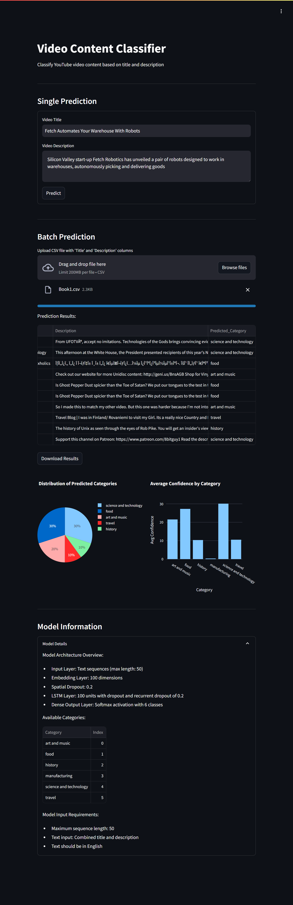

# Videos Classification



## Project Overview

The Videos Classification project is a machine learning-powered application that classifies YouTube videos into categories based on their titles and descriptions. Using a sophisticated LSTM neural network trained on YouTube video data, it provides accurate categorization for both single videos and batch processing.

The application analyzes video titles and descriptions to classify content into six categories:
- Art and Music 
- Food
- History
- Manufacturing
- Science and Technology
- Travel

The project showcases the practical application of natural language processing and deep learning in content classification, featuring:
- Interactive web interface built with Streamlit
- Real-time video classification
- Batch processing capabilities
- Visual analysis of prediction probabilities
- Multiple deployment options for different use cases

## Table of Contents

1. [Model Architecture](#model-architecture)
2. [Data Preprocessing](#data-preprocessing)
3. [Streamlit Application](#streamlit-application)
4. [Deployment Options](#deployment-options)
5. [File Structure](#file-structure)
6. [Usage](#usage)
7. [License](#license)

## Model Architecture

The model uses a deep learning architecture specifically designed for text classification:
- Input Layer: Text sequences (max length: 50)
- Embedding Layer: 100 dimensions
- Spatial Dropout: 0.2
- LSTM Layer: 100 units with dropout and recurrent dropout of 0.2
- Dense Output Layer: Softmax activation with 6 classes

The model training process is detailed in the Jupyter notebook:
- `Videos_Classification.ipynb`: Data preprocessing, model development, and training

## Data Preprocessing

The preprocessing pipeline includes:
1. Text cleaning and normalization
2. Stop words removal
3. Tokenization using Keras Tokenizer
4. Sequence padding
5. Label encoding for categories

Note: The training dataset is not included in this repository due to size limitations.

## Streamlit Application

The application (`app/app.py`) provides an intuitive interface for:
- Single video classification with confidence scores
- Batch classification through CSV upload
- Visualization of prediction probabilities
- Category distribution analysis for batch predictions

## Deployment Options Detailed Guide

### 1. Local Deployment
First ensure you have Python 3.8+ installed on your system:
```bash
git clone https://github.com/pouryare/videos-classification.git
cd videos-classification/app
python -m venv venv
source venv/bin/activate  # On Windows use `venv\Scripts\activate`
pip install -r requirements.txt
streamlit run app.py
```
Access at `http://localhost:8501`

### 2. Docker Deployment
Ensure Docker is installed. Two options:

a) Pull and run the pre-built image:
```bash
docker pull pouryare/videos-classification:latest
docker run -p 8501:8501 pouryare/videos-classification:latest
```

b) Build and run locally:
```bash
cd app
docker build -t videos-classification:latest .
docker run -p 8501:8501 videos-classification:latest
```
Access at `http://localhost:8501`

### 3. Heroku Deployment
Prerequisites:
- Heroku account
- Heroku CLI installed
- Git installed

Steps:
```bash
heroku login
heroku create videos-classification
heroku buildpacks:add --index 1 heroku/python
heroku buildpacks:add --index 2 https://github.com/heroku/heroku-buildpack-apt
git push heroku main
```

### 4. AWS EC2 Deployment
Prerequisites:
- AWS account
- EC2 instance running Amazon Linux 2
- SSH access

Steps:
1. Connect to EC2:
```bash
ssh -i your-key.pem ec2-user@your-instance-ip
```

2. Install dependencies:
```bash
sudo yum update -y
sudo yum install git python3 python3-pip -y
```

3. Setup application:
```bash
git clone https://github.com/pouryare/videos-classification.git
cd videos-classification/app
pip3 install -r requirements.txt
streamlit run app.py
```

4. Configure security group (port 8501)

### 5. Google Cloud Platform Deployment
Prerequisites:
- Google Cloud account
- Google Cloud SDK installed
- Project created

Steps:
```bash
gcloud init
gcloud app create
gcloud app deploy
gcloud app browse
```

### 6. Microsoft Azure Deployment
Prerequisites:
- Azure account
- Azure CLI installed
- Resource group created

Steps:
```bash
az webapp create --resource-group myResourceGroup \
                 --plan myAppServicePlan \
                 --name videos-classification \
                 --runtime "PYTHON|3.8"

az webapp deployment source config \
    --name videos-classification \
    --resource-group myResourceGroup \
    --repo-url https://github.com/pouryare/videos-classification.git \
    --branch main \
    --manual-integration
```

## File Structure
```
videos-classification/
├── app/
│   ├── app.py
│   ├── app.yaml
│   ├── Dockerfile
│   ├── Procfile
│   ├── requirements.txt
│   ├── setup.py
│   ├── setup.sh
│   ├── video_classification_model.keras
│   ├── tokenizer.joblib
│   └── label_encoder.joblib
├── Videos_Classification.ipynb
├── README.md
└── screenshot.png
```

## Usage

1. Access the application through your preferred deployment method
2. For single prediction:
   - Enter video title and description
   - Click "Predict" button
   - View prediction and confidence scores
3. For batch prediction:
   - Prepare CSV file with 'Title' and 'Description' columns
   - Upload file
   - Download results or view visualizations
4. Explore prediction probabilities and category distributions

## License

This project is licensed under the MIT License. See the [MIT License](https://opensource.org/licenses/MIT) page for details.

---

For issues or suggestions, please open an issue on the [GitHub repository](https://github.com/pouryare/videos-classification).

This project demonstrates the power of deep learning in content classification, providing an accessible tool for automated video categorization. Whether you're a content creator, platform manager, or ML enthusiast, this tool offers practical insights into video content classification.

